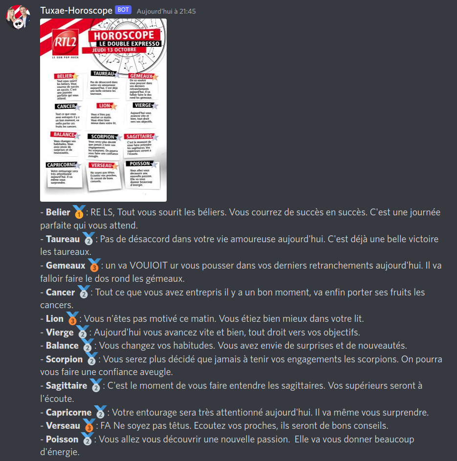

# Tuxae Horoscope



## Usage

You need `docker` and `docker-compose` as well. Note: you may need to edit the `Makefile` to use
`docker compose` instead of `docker-compose`.

Using the Makefile (`sudo apt install make` if you don't have `make` command):

```bash
make up
```

It will start two containers: one is the scraper and the other is the Discord Bot

To stop the bot immediately:

```bash
make down
```

## Update Docker Image

The Docker Image `horoscope-bot` relies on a `Pipfile`. We already provide a `Pipfile.lock` in the repository.
If needed, you can update `Pipfile.lock` to upgrade some versions.

To do so,
```bash
make build_lock  # Build a Docker Image to run pipenv lock inside
make lock
```

## Horoscope scraping
Details are available in ``scraper`` folder. It's mainly based on mobile web app to ease web scraping.

## Horoscope parsing
Functions to parse a horoscope image are found in `rtl2_horoscope/parse.py`.

## Requirements
Parsing functionalities require installing Tesseract OCR on your computer as well as the `pytesseract` package.
It also requires installing `pillow`.

```
sudo apt install tesseract-ocr tesseract-ocr-fra
```

## Usage
The general wrapper function you should use is `parse_horoscope`:

    Parse texts and stars in a horoscope image and return info as a dict.

    Args:
        img (PIL.Image or str): Image to read or path to image.
        threads (int or None): Number of threads to use for reading blocks of text.
            12 (number of text blocks to read) is empirically the fastest.
            If 1, will use a normal loop for easier debugging.
            Default: 12.
        verbose (bool): Whether to display a progressbar.
            Default: True.

    Returns:
        dict with zodiac signs as keys and (star_color, text) tuples as values.


Usage example:

    >>> parse_horoscope("examples/photo103.jpg", threads=1, verbose=False)
    {'belier': ('argent',
      'Votre journée sera rythmée par des bonnes nouvelles les béliers.'),
     'taureau': ('argent',
      'Votre enthousiasme est très apprécié par votre hiérarchie, vous vous démarquez des autres.'),
     'gemeaux': ('bronze',
      'Vous n‘êtes pas dans votre assiette les gémeaux. Ca ira mieux demain.'),
     'cancer': ('argent',
      'Prenez un instant pour vous ! Un peu de détente vous fera le plus grand bien.'),
     'lion': ('argent',
      'Votre tempérament de leader vous ménera loin les lions, on vous fait confiance.'),
     'vierge': ('argent',
      'Vous avez bonne mine et on vous le dit. De quoi retrouver le sourire.'),
     'balance': ('argent',
      'Votre entourage est aux petits soins pour vous ! Vous avez de la chance les balances.'),
     'scorpion': ('or',
      'Votre bienveillance  et votre belle énergie plaisent ! Vous êtes  LA personne avec qui on veut passer du temp:'),
     'sagittaire': ('bronze',
      'Vous prenez tout  par dessus la jambe.  1l est temps de vous impliquer beaucoup plus !'),
     'capricorne': ('argent',
      'Votre persévérance porte ses fruits. Vous devenez incroyable.'),
     'verseau': ('argent',
      'Le moment est venu de vous lancer dans les projets que vous laissiez de côté depuis un moment.'),
     'poisson': ('bronze',
      'Votre corps réclame une pause, ne tirez \\pas trop sur la corde.')}

